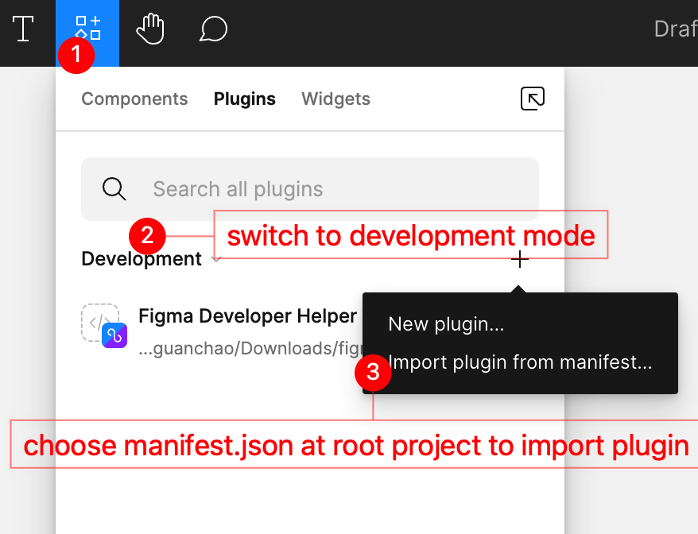

# Figma Developer Helper

## Quick Start

### Download

Clone project to local.

```shell
git clone git@gitlab.rippletek.com:wuguanchao/figma-developer-helper.git

cd figma-developer-helper

npm i
```

### Configure

Duplicate `.env` to `.env.local` and fill 2 env vars:

```shell
OSS_ACCESS_KEY_ID=
OSS_ACCESS_KEY_SECRET=
```

### Build

```shell
npm run build
```

### Preparation

Download Figma APP on [https://www.figma.com/downloads/](https://www.figma.com/downloads/)

Import plugin to Figma follow these steps below.



### Run

Run api server first.

```shell
npm run server.
```

And everything works.

### FYI

1. set alias `fds` to `cd [project-path] && npm run server`, and then you can just type `fds` to activate server.